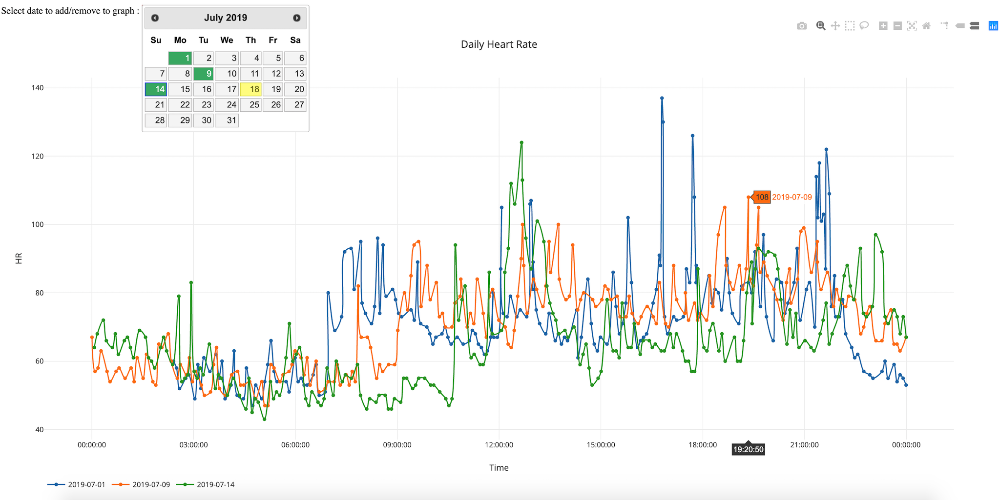

# polargraph
Transform data from Polar A360 tracker into HTML dynamic graphs

## Purpose 
Purpose of this very simple tool is to :
- read JSON data from Polar A360 tracker 
- add data to web graph generated with Ploty javascript module
- let user add/remove new data to the existing graph

This small project has been first been developed to complete web
interfaces proposed by Polar.

## Requirements
Following javascript modules are required :
- [jQuery](https://jquery.com/)
- [jQuery UI](https://jqueryui.com/)
- [Plotly.js](https://plot.ly/javascript/)

## Get data from Polar Flow
First of all, you will have to get data from A360 tracker. As the 
activity tracker is able to synchronize with Polar Flow website,
it is easier to extract data as JSON file directly from ths website:
- log into [Polar Flow](https://flow.polar.com/) using Chrome
- go to `Agenda` menu, then `Activity` submenu
- in the meantime, open `Developer Tools` console in Chrome
- open `Network` tab in the developer console
- in Polar Flow, click on left arrow to select yesterday (do not use the calendar)
- in developer console, right-click on URL displayed in network tab
- select `Copy` and `Copy link address`
- now paste into Chrome URL bar to get JSON data with regards to yesterday
- save JSON data into `data` local directory

Note that URL to get will look like this:
```
https://flow.polar.com/api/activity-timeline/load?day=2019-07-08&maxSampleCount=200
```

Once you have retrieved all JSON
## Run web server
You could run a simple web server by running that commad into root directory:
```
$ python -m SimpleHTTPServer 80
```

## Sample 

